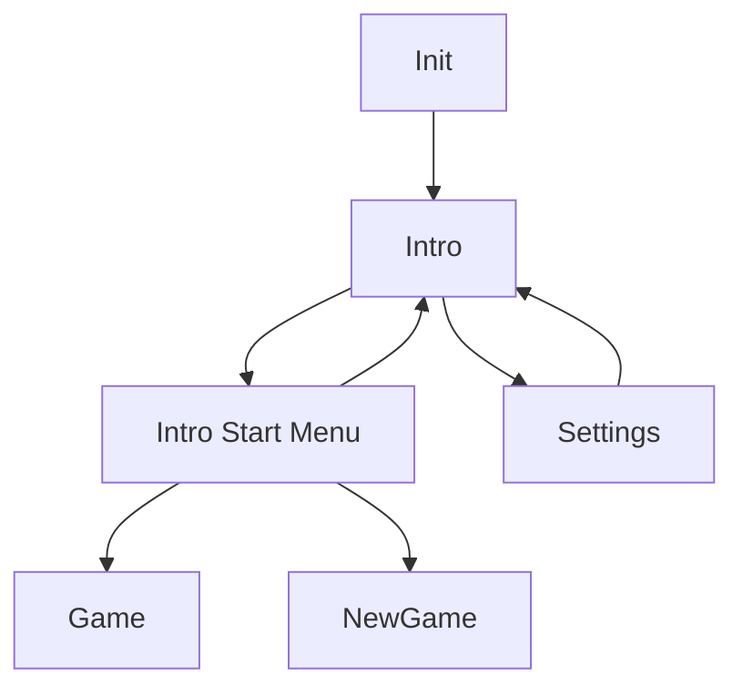

# Epiteleo

Epiteleo is a Zig + raylib project organized around an app state machine, async loader transitions, modular runtime systems, and data-driven sprite metadata.

The project currently provides a playable shell with intro/menu flow, settings persistence, a new-game name input screen, canvas and camera controls, debug overlays, and loading transitions.

## Requirements

- Zig 0.16.0 or newer
- A desktop environment that can create a raylib window

## Quick Start

Build the executable:

```bash
zig build
```

Run the app:

```bash
zig build run
```

Pass runtime args through Zig:

```bash
zig build run -- <args>
```

The executable is named epiteleo.

## Runtime Overview

- Window title: Epiteleo
- Initial window size: 960x540
- Target FPS: 60
- Default app state sequence on startup:

1. Init
2. Intro (loaded through loader job)

Available app states:

- Init
- Intro
- NewGame
- Settings
- Game

State transitions can be direct or go through the loader when a background/main-thread job is required.

## State Flow



Notes:

- Intro start menu options depend on whether .data/save_data.z exists.
- Loader shows a fade-in/fade-out loading screen while jobs run.

## Controls

### Menu Navigation

- W or Up: previous option
- S or Down: next option
- Enter: confirm

### Intro Screens

Init menu:

- Stat Game (current in-code label)
- Settings
- Exit

Start menu when save data exists:

- Continue
- New Game
- Back

Start menu when save data does not exist:

- New Game
- Back

### Settings Screen

- W or Up: move selection up
- S or Down: move selection down
- A or Left: decrease value for selected numeric option
- D or Right: increase value for selected numeric option
- Enter on Back: return to previous state

Settings values:

- Volume: 0 to 100 in steps of 10
- Difficulty: 0 to 3

### New Game Screen

- Text input is focused by default
- Enter prints: Start game with name: <input>

### Camera Controls (Free Mode)

- W A S D or arrow keys: move camera target
- Hold LeftShift or RightShift with movement: 4x movement speed
- Mouse/trackpad scroll without Shift: pan camera
- Hold Shift and use vertical scroll: zoom
- Equal: zoom in
- Minus: zoom out
- LeftBracket and RightBracket: rotate
- Hold Alt and scroll: rotate
- Hold LeftClick + Shift and drag: pan by dragging

### Debug Overlay Controls

Debug module is enabled in the current app configuration.

- LeftControl + 1: toggle app debug panel
- LeftControl + 2: toggle input handler debug panel
- LeftControl + 3: toggle camera debug panel
- LeftControl + 4: toggle canvas debug panel
- LeftControl + 5: toggle settings debug panel placeholder
- LeftControl + 0: hide all debug panels

Additional keys while camera debug panel is active:

- 0: cycle camera mode Free -> Fixed -> Follow -> Free
- 9: toggle snap-to-canvas constraint

Additional key while app debug panel is active:

- 0: run a 5-second loader sleep job

## Data and Assets

Runtime data files created/used in .data:

- .data/settings.z
- .data/save_data.z (presence check is used for Continue visibility)

Important asset paths loaded at runtime:

- assets/fonts/JetBrains.ttf
- assets/screens/intro_screen.png
- assets/screens/loading_screen.png
- assets/screens/player_screen.png
- assets/sprites/.../data.z

If an asset is missing, most loaders fail gracefully and skip that visual resource.

## Project Structure

High-level module responsibilities:

- src/root.zig: App orchestration, state machine, main update/draw loop
- src/modules/loader: async job execution, loading screen, transition gating
- src/modules/intro: intro/menu flow and state decisions
- src/modules/settings: settings UI and persistence
- src/modules/new_game: text input based new-game screen shell
- src/modules/game: game screen shell and fade timer
- src/modules/camera: free/follow/fixed camera logic with smoothing and clamping
- src/modules/canvas: world rectangle, grid rendering, drag selection
- src/modules/input_handler: keyboard/mouse abstraction and active key/click tracking
- src/modules/sprite: data-driven sprite animation metadata and frame updates
- src/modules/ui: drawing helpers, font loading, text input creation
- src/modules/\_\_dev: debug overlays and debug-only controls

## Persistence Format

Settings are stored in a simple key=value format, for example:

```text
volume=50
difficulty=1
```

## Current Implementation Notes

- Game and NewGame states are still framework shells and not full gameplay.
- Intro and state loading are integrated with loader transitions.
- Camera movement, zoom, and rotation use lerp-style smoothing.
- Window resize support is tied to the debug module presence in current code.

## Troubleshooting

- If the app runs but text is missing, verify assets/fonts/JetBrains.ttf exists.
- If menus appear but backgrounds/sprites are blank, verify assets/screens and assets/sprites files exist.
- If settings are not retained, confirm the process can create/write .data/settings.z.
