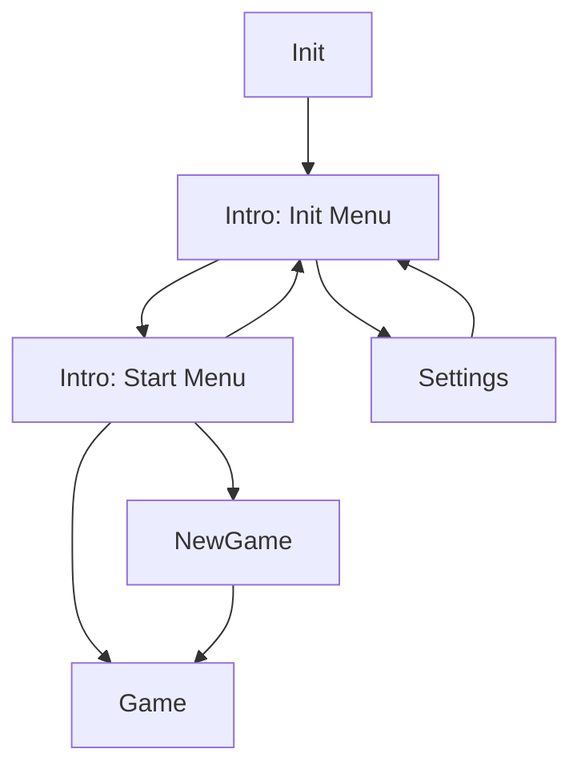

# Epiteleo

Epiteleo is a Zig + raylib prototype built around a modular state machine, async loader transitions, data-driven sprite metadata, and a debug-first development loop.

The current project includes:

- Intro and start-menu flow
- Settings UI with persistence
- New-game name entry screen
- Core game shell with player movement and animation
- Camera/canvas systems
- Dev overlays and debug hotkeys

## Requirements

- Zig 0.16.0
- Desktop environment with a working graphics stack for raylib

## Quick Start

Build:

```bash
zig build
```

Run:

```bash
zig build run
```

Pass args to the runtime:

```bash
zig build run -- <args>
```

Binary name: epiteleo

## Runtime Summary

- Window title: Epiteleo
- Initial size: 960x540
- Target FPS: 60
- Main app states: Init, Intro, NewGame, Settings, Game

Transitions can be immediate or routed through the loader for task-based loading.

## State Flow


```mermaid
flowchart TD
	A[Init] --> B[Intro: Init Menu]
	B --> C[Intro: Start Menu]
	B --> D[Settings]
	C --> E[Game]
	C --> F[NewGame]
	C --> B
	D --> B
	F --> E
```

Start-menu options depend on whether player data exists at .data/player_data.z.

## Controls

### Menu Navigation

- W or Up: previous option
- S or Down: next option
- Enter: confirm

### Intro Menus

Init menu entries:

- Start Game
- Settings
- Exit

Start menu when player data exists:

- Continue
- New Game
- Back

Start menu when player data does not exist:

- New Game
- Back

### Settings Screen

- W or Up: move selection up
- S or Down: move selection down
- A or Left: decrease selected value
- D or Right: increase selected value
- Enter on Back: return

Settings ranges:

- Volume: 0 to 100 (step 10)
- Difficulty: 0 to 3 (step 1)

### New Game Screen

- Text input is focused by default
- Enter confirms and transitions into Game through loader task

### Player Movement (Game)

- W/A/S/D or arrows: movement input
- LeftShift or RightShift: run modifier
- Space: attack state

Movement behavior:

- Latest active movement key takes precedence for direction
- Orthogonal axis gets heavier damping while steering
- Coasting drag is velocity-dependent (higher speed carries longer)

### Camera Controls (Free Camera Mode)

- W/A/S/D or arrows: pan camera
- Hold LeftShift or RightShift with movement: faster camera pan
- Mouse/trackpad scroll without Shift: pan
- Hold Shift + vertical scroll: zoom
- Equal: zoom in
- Minus: zoom out
- LeftBracket / RightBracket: rotate
- Hold Alt + scroll: rotate
- Hold LeftClick + Shift and drag: mouse pan

### Dev Overlay Controls

Toggle overlays:

- LeftControl + 0: hide all debug overlays
- LeftControl + 1: app overlay
- LeftControl + 2: input handler overlay
- LeftControl + 3: camera overlay
- LeftControl + 4: canvas overlay
- LeftControl + 5: settings overlay placeholder
- LeftControl + 6: game overlay

While app overlay is active:

- 0: trigger loader sleep test job (5 seconds)

While camera overlay is active:

- 0: cycle camera mode Free -> Fixed -> Follow -> Free
- 9: toggle snap-to-canvas

While game overlay is active:

- 0: save player data
- 1: cycle player sprite type and reload sprite metadata

## Persistence

Runtime files under .data:

- .data/settings.z
- .data/player_data.z

### settings.z format

```text
volume=50
difficulty=1
```

### player_data.z format

```text
name=Player
play_time=0
pos=0,0
```

## Asset Expectations

Core runtime assets include:

- assets/fonts/JetBrains.ttf
- assets/screens/intro_screen.png
- assets/screens/loading_screen.png
- assets/screens/player_screen.png
- assets/sprites/<sprite>/data.z
- assets/sprites/<sprite>/spritesheet.png

If an asset is missing, many loaders fail gracefully and simply skip drawing that resource.

## Codebase Structure

- src/main.zig: process entry, app construction
- src/root.zig: app orchestration, state machine, draw/update loop
- src/\_ih: keyboard/mouse input abstraction
- src/\_ui: drawing helpers and font/text components
- src/modules/intro: intro/start menu states
- src/modules/settings: settings UI and persistence
- src/modules/new_game: new-game UI and name input
- src/modules/game: gameplay shell and player integration
- src/modules/player: player state, movement, persistence
- src/modules/sprite: animation/data-driven sprite metadata
- src/modules/camera: free/follow/fixed camera logic
- src/modules/canvas: world/canvas rendering helpers
- src/modules/loader: async loading and transition screen
- src/modules/\_\_dev: debug overlays and hotkeys

## Current Notes

- Game loop and systems are a playable foundation, not final gameplay.
- Loader transitions and fade timers are actively used across state changes.
- Window-resizable behavior is currently tied to dev-module presence in app init.

## Known Issues

- No known issues currently tracked in this README section.

## Troubleshooting

- Missing text: verify assets/fonts/JetBrains.ttf.
- Missing backgrounds/sprites: verify assets/screens and assets/sprites paths.
- Settings not retained: confirm write access to .data/settings.z.
- Continue/New Game menu behavior unexpected: verify .data/player_data.z exists and is readable.
