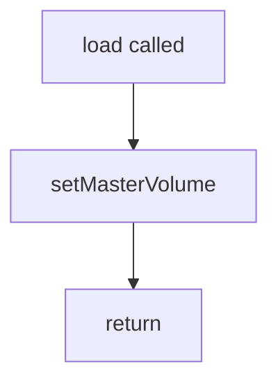
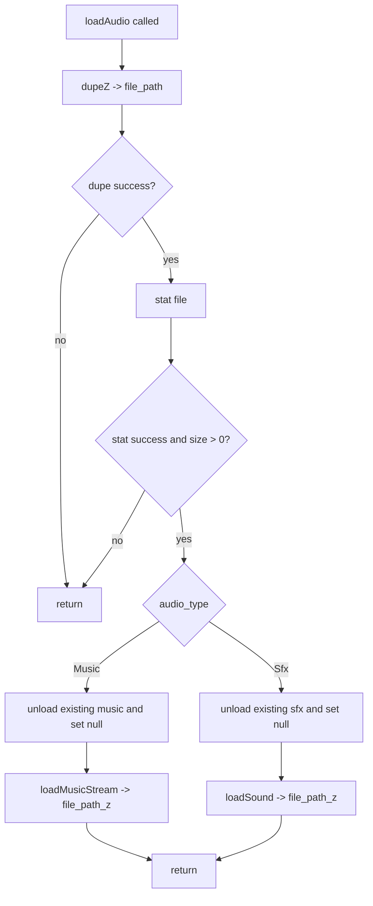
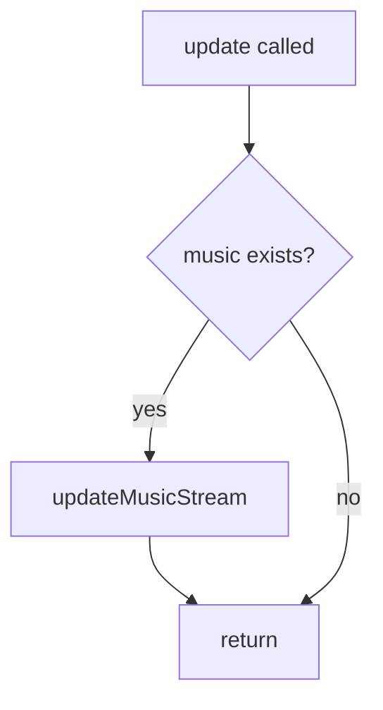

# src/\_ah/root.zig flow

## load(self: \*AudioHandler, master_volume)

## loadAudio(self: \*AudioHandler, io, audio_type, file_path, key)

## update(self: \*AudioHandler)

## draw

No draw method exists in this root file.
