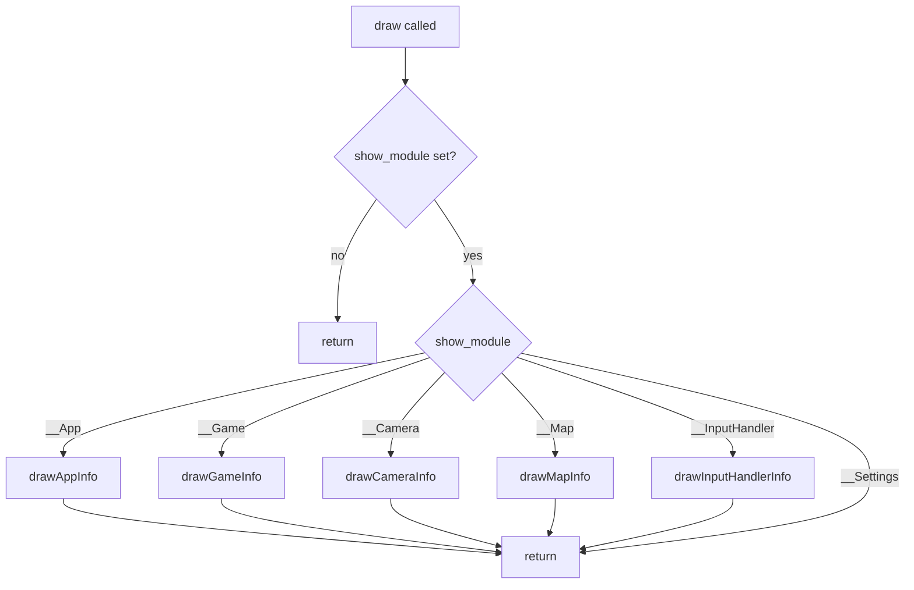
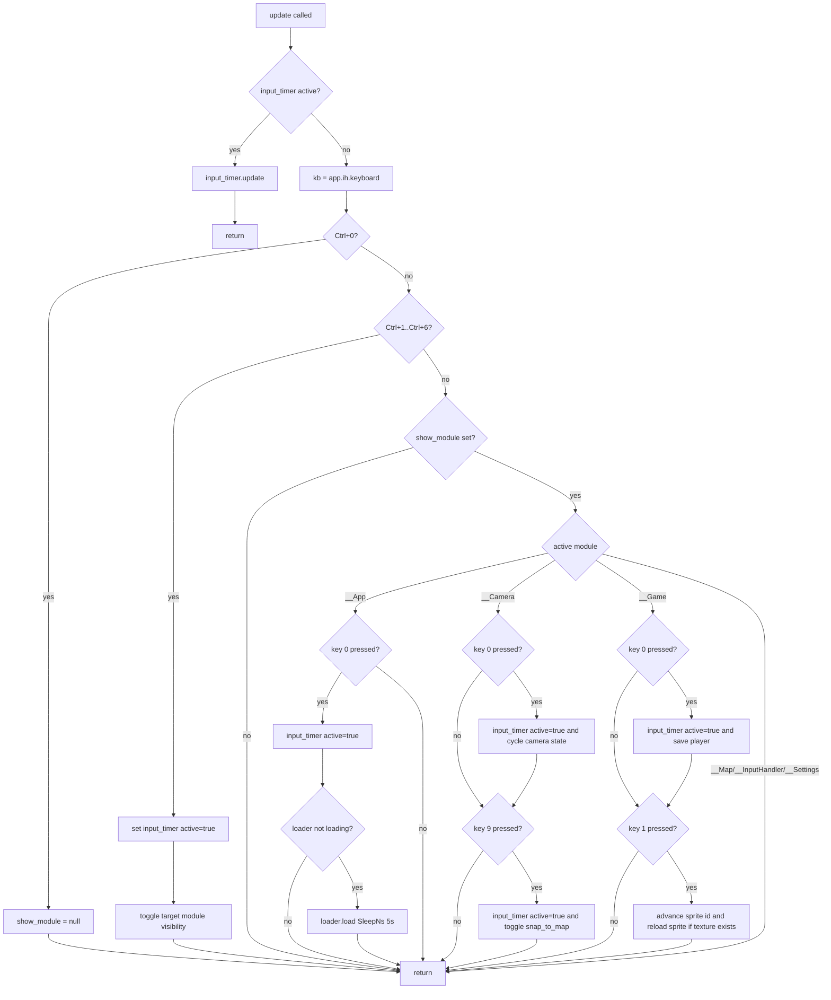

# src/\_\_dev/root.zig flow

## draw(self: Dev, app)

```mermaid
flowchart TD
    A[draw called] --> B{show_module set?}
    B -- no --> Z1[return]
    B -- yes --> C{show_module}
    C -- __App --> D[drawAppInfo] --> Z2[return]
    C -- __Game --> E[drawGameInfo] --> Z2
    C -- __Camera --> F[drawCameraInfo] --> Z2
    C -- __Map --> G[drawMapInfo] --> Z2
    C -- __InputHandler --> H[drawInputHandlerInfo] --> Z2
    C -- __Settings --> Z2
```

## update(self: \*Dev, app)

```mermaid
flowchart TD
    A[update called] --> B{input_timer active?}
    B -- yes --> C[input_timer.update] --> Z1[return]
    B -- no --> D[kb = app.ih.keyboard]
    D --> E{Ctrl+0?}
    E -- yes --> F[show_module = null] --> Z2[return]
    E -- no --> G{Ctrl+1..Ctrl+6?}
    G -- yes --> H[set input_timer active=true]
    H --> I[toggle target module visibility]
    I --> Z2
    G -- no --> J{show_module set?}
    J -- no --> Z2
    J -- yes --> K{active module}

    K -- __App --> L{key 0 pressed?}
    L -- yes --> M[input_timer active=true]
    M --> N{loader not loading?}
    N -- yes --> O[loader.load SleepNs 5s]
    N -- no --> Z2
    O --> Z2
    L -- no --> Z2

    K -- __Camera --> P{key 0 pressed?}
    P -- yes --> Q[input_timer active=true and cycle camera state]
    P -- no --> R
    Q --> R{key 9 pressed?}
    R -- yes --> S[input_timer active=true and toggle snap_to_map]
    R -- no --> Z2
    S --> Z2

    K -- __Game --> T{key 0 pressed?}
    T -- yes --> U[input_timer active=true and save player]
    T -- no --> V
    U --> V{key 1 pressed?}
    V -- yes --> W[advance sprite id and reload sprite if texture exists]
    V -- no --> Z2
    W --> Z2

    K -- __Map/__InputHandler/__Settings --> Z2
```

## load

No load method exists in this root file.
