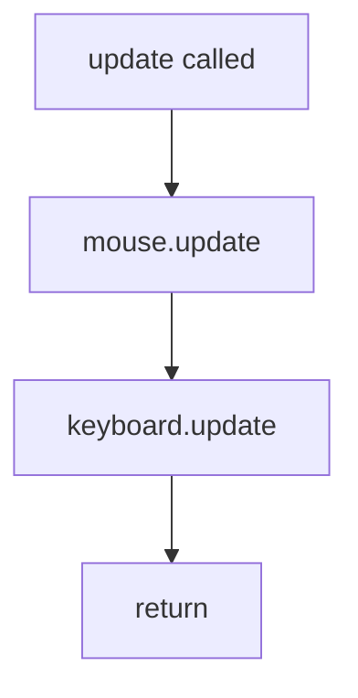

# src/\_ih/root.zig flow

## update(self: \*InputHandler)

```mermaid
flowchart TD
    A[update called] --> B[mouse.update]
    B --> C[keyboard.update]
    C --> Z[return]
```

## draw

No draw method exists in this root file.

## load

No load method exists in this root file.
