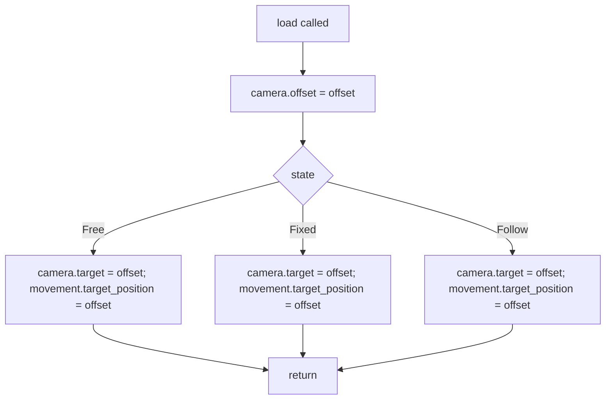
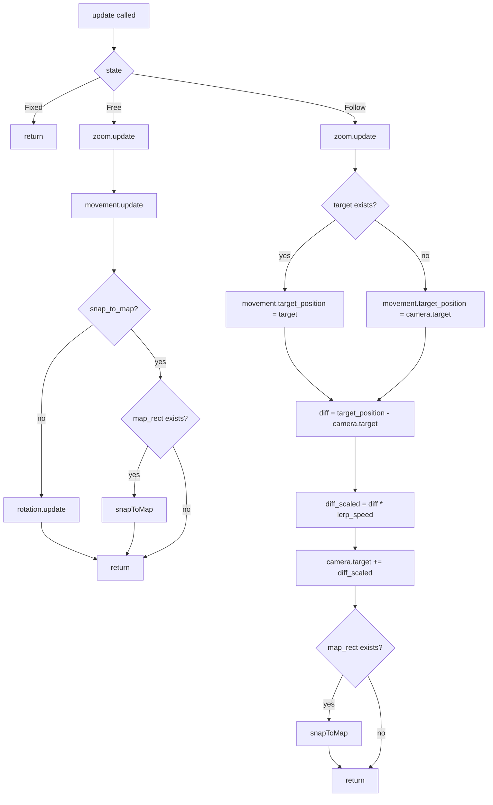

# src/modules/camera/root.zig flow

## load(self: \*Camera, offset)

```mermaid
flowchart TD
    A[load called] --> B[camera.offset = offset]
    B --> C{state}
    C -- Free --> D[camera.target = offset; movement.target_position = offset]
    C -- Fixed --> E[camera.target = offset; movement.target_position = offset]
    C -- Follow --> F[camera.target = offset; movement.target_position = offset]
    D --> Z[return]
    E --> Z
    F --> Z
```

## update(self: \*Camera, ih, target, map_rect)

```mermaid
flowchart TD
    A[update called] --> B{state}

    B -- Fixed --> Z1[return]

    B -- Free --> C[zoom.update]
    C --> D[movement.update]
    D --> E{snap_to_map?}
    E -- no --> F[rotation.update] --> Z2[return]
    E -- yes --> G{map_rect exists?}
    G -- yes --> H[snapToMap] --> Z2
    G -- no --> Z2

    B -- Follow --> I[zoom.update]
    I --> J{target exists?}
    J -- yes --> K[movement.target_position = target]
    J -- no --> L[movement.target_position = camera.target]
    K --> M[diff = target_position - camera.target]
    L --> M
    M --> N[diff_scaled = diff * lerp_speed]
    N --> O[camera.target += diff_scaled]
    O --> P{map_rect exists?}
    P -- yes --> Q[snapToMap] --> Z3[return]
    P -- no --> Z3
```

## draw

No draw method exists in this root file.
