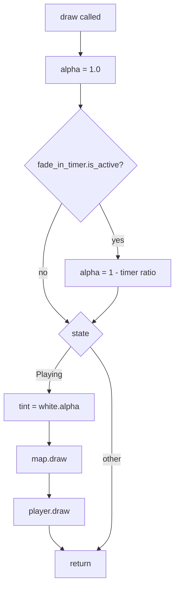
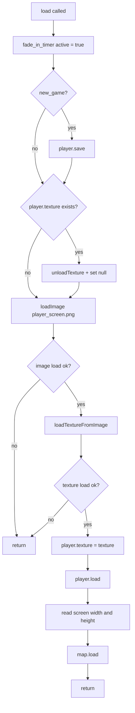
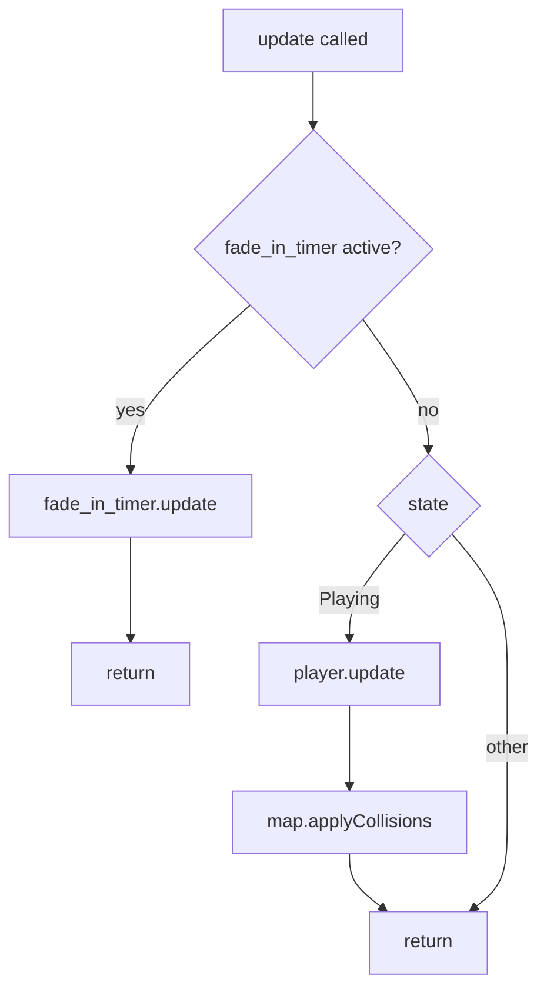

# src/modules/game/root.zig flow

## draw(self: \*Game)

```mermaid
flowchart TD
    A[draw called] --> B[alpha = 1.0]
    B --> C{fade_in_timer.is_active?}
    C -- yes --> D[alpha = 1 - timer ratio]
    C -- no --> E
    D --> E{state}
    E -- Playing --> F[tint = white.alpha]
    F --> G[map.draw]
    G --> H[player.draw]
    H --> Z[return]
    E -- other --> Z
```

## load(self: \*Game, io)

```mermaid
flowchart TD
    A[load called] --> B[fade_in_timer active = true]
    B --> C{new_game?}
    C -- yes --> D[player.save]
    C -- no --> E
    D --> E{player.texture exists?}
    E -- yes --> F[unloadTexture + set null]
    E -- no --> G
    F --> G[loadImage player_screen.png]
    G --> H{image load ok?}
    H -- no --> Z1[return]
    H -- yes --> I[loadTextureFromImage]
    I --> J{texture load ok?}
    J -- no --> Z1
    J -- yes --> K[player.texture = texture]
    K --> L[player.load]
    L --> M[read screen width and height]
    M --> N[map.load]
    N --> Z2[return]
```

## update(self: \*Game, ih)

```mermaid
flowchart TD
    A[update called] --> B{fade_in_timer active?}
    B -- yes --> C[fade_in_timer.update] --> Z1[return]
    B -- no --> D{state}
    D -- Playing --> E[player.update]
    E --> F[map.applyCollisions]
    F --> Z2[return]
    D -- other --> Z2
```
