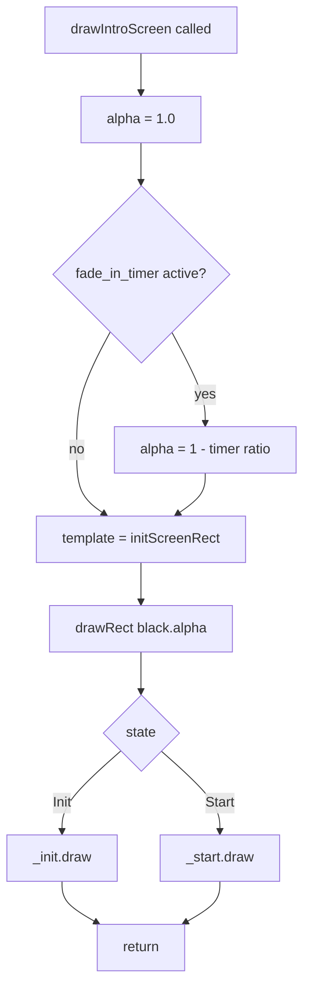
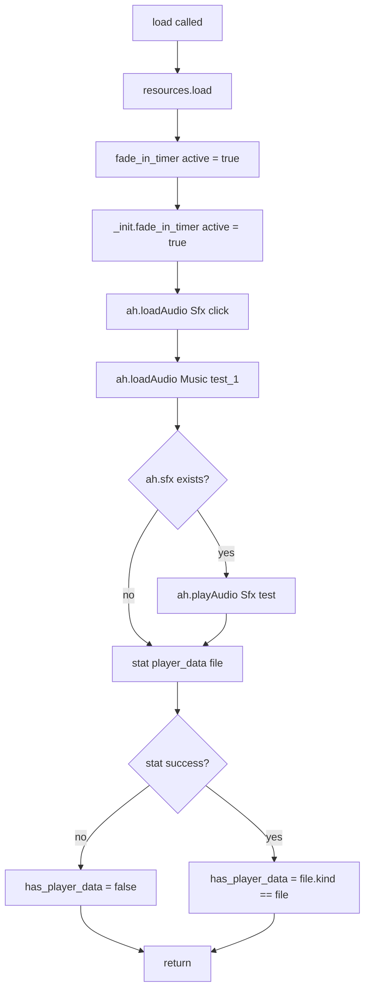
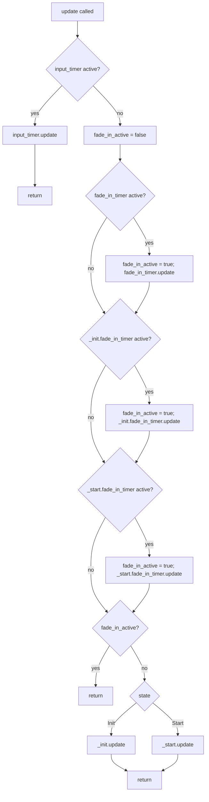

# src/modules/intro/root.zig flow

## drawIntroScreen(self: \*Intro, font)

```mermaid
flowchart TD
    A[drawIntroScreen called] --> B[alpha = 1.0]
    B --> C{fade_in_timer active?}
    C -- yes --> D[alpha = 1 - timer ratio]
    C -- no --> E
    D --> E[template = initScreenRect]
    E --> F[drawRect black.alpha]
    F --> G{state}
    G -- Init --> H[_init.draw] --> Z[return]
    G -- Start --> I[_start.draw] --> Z
```

## load(self: \*Intro, io, ah)

```mermaid
flowchart TD
    A[load called] --> B[resources.load]
    B --> C[fade_in_timer active = true]
    C --> D[_init.fade_in_timer active = true]
    D --> E[ah.loadAudio Sfx click]
    E --> F[ah.loadAudio Music test_1]
    F --> G{ah.sfx exists?}
    G -- yes --> H[ah.playAudio Sfx test]
    G -- no --> I
    H --> I[stat player_data file]
    I --> J{stat success?}
    J -- no --> K[has_player_data = false] --> Z[return]
    J -- yes --> L[has_player_data = file.kind == file] --> Z
```

## update(self: \*Intro, app)

```mermaid
flowchart TD
    A[update called] --> B{input_timer active?}
    B -- yes --> C[input_timer.update] --> Z1[return]
    B -- no --> D[fade_in_active = false]
    D --> E{fade_in_timer active?}
    E -- yes --> E1[fade_in_active = true; fade_in_timer.update]
    E -- no --> F
    E1 --> F{_init.fade_in_timer active?}
    F -- yes --> F1[fade_in_active = true; _init.fade_in_timer.update]
    F -- no --> G
    F1 --> G{_start.fade_in_timer active?}
    G -- yes --> G1[fade_in_active = true; _start.fade_in_timer.update]
    G -- no --> H
    G1 --> H{fade_in_active?}
    H -- yes --> Z2[return]
    H -- no --> I{state}
    I -- Init --> J[_init.update] --> Z3[return]
    I -- Start --> K[_start.update] --> Z3
```
