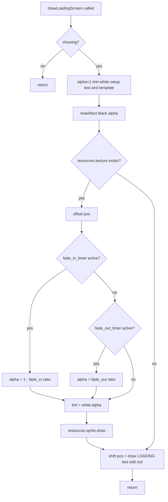
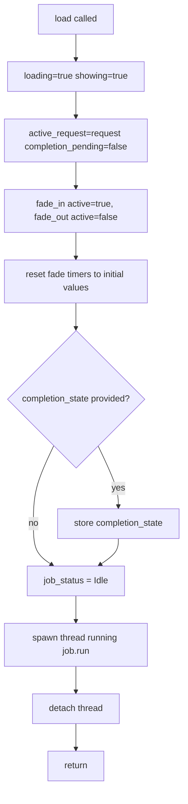
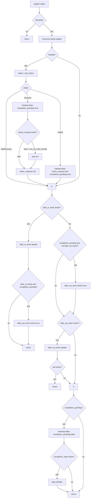

# src/modules/loader/root.zig flow

## drawLoadingScreen(self: \*Loader, font)

```mermaid
flowchart TD
    A[drawLoadingScreen called] --> B{showing?}
    B -- no --> Z1[return]
    B -- yes --> C[alpha=1 tint=white setup text and template]
    C --> D[drawRect black alpha]
    D --> E{resources.texture exists?}
    E -- yes --> F[offset pos]
    F --> G{fade_in_timer active?}
    G -- yes --> H[alpha = 1 - fade_in ratio]
    G -- no --> I{fade_out_timer active?}
    I -- yes --> J[alpha = fade_out ratio]
    I -- no --> K
    H --> K[tint = white.alpha]
    J --> K
    K --> L[resources.sprite.draw]
    E -- no --> M
    L --> M[shift pos + draw LOADING text with tint]
    M --> Z2[return]
```

## load(self: \*Loader, request, completion_state)

```mermaid
flowchart TD
    A[load called] --> B[loading=true showing=true]
    B --> C[active_request=request completion_pending=false]
    C --> D[fade_in active=true, fade_out active=false]
    D --> E[reset fade timers to initial values]
    E --> F{completion_state provided?}
    F -- yes --> G[store completion_state]
    F -- no --> H
    G --> H[job_status = Idle]
    H --> I[spawn thread running job.run]
    I --> J[detach thread]
    J --> Z[return]
```

## update(self: \*Loader, app)

```mermaid
flowchart TD
    A[update called] --> B{showing?}
    B -- no --> Z1[return]
    B -- yes --> C[resources.sprite.update]
    C --> D{loading?}

    D -- yes --> E[status = job_status]
    E --> F{status}
    F -- Success --> G[loading=false completion_pending=true]
    G --> H{active_request exists?}
    H -- Task + run_on_main_thread --> H1[task.run]
    H -- else --> I
    H1 --> I[active_request=null]
    F -- Failed --> J[loading=false active_request=null completion_pending=true]
    F -- Idle/Running --> K
    I --> K
    J --> K

    D -- no --> K
    K --> L{fade_in_timer active?}
    L -- yes --> M[fade_in_timer.update]
    M --> N{fade_in ended and completion_pending?}
    N -- yes --> O[fade_out_timer active=true]
    N -- no --> Z2[return]
    O --> Z2

    L -- no --> P{completion_pending and not fade_out active?}
    P -- yes --> Q[fade_out_timer active=true]
    P -- no --> R
    Q --> R{fade_out_timer active?}
    R -- yes --> S[fade_out_timer.update]
    S --> T{still active?}
    T -- yes --> Z3[return]
    T -- no --> U
    R -- no --> U

    U --> V{completion_pending?}
    V -- yes --> W[showing=false completion_pending=false]
    W --> X{completion_state exists?}
    X -- yes --> Y[app.setState] --> Z4[return]
    X -- no --> Z4
    V -- no --> Z4
```
