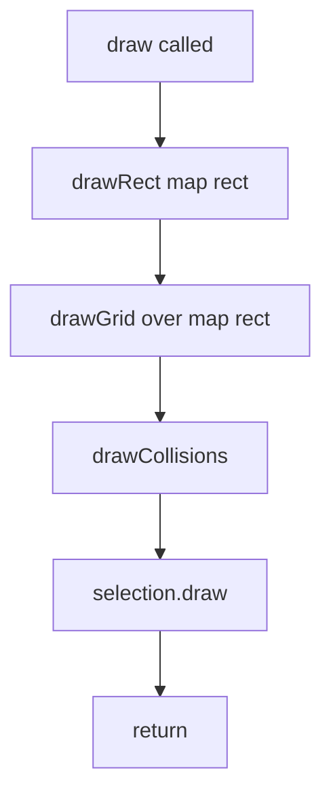
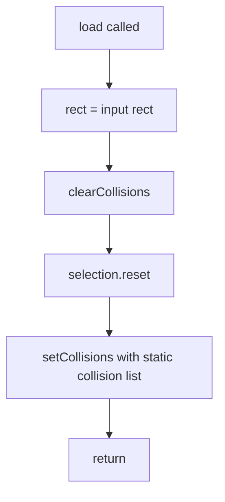
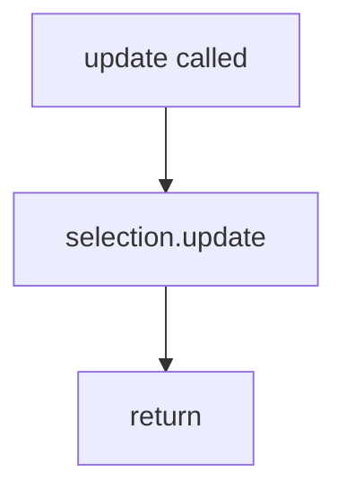

# src/modules/map/root.zig flow

## draw(self: \*Map)

```mermaid
flowchart TD
    A[draw called] --> B[drawRect map rect]
    B --> C[drawGrid over map rect]
    C --> D[drawCollisions]
    D --> E[selection.draw]
    E --> Z[return]
```

## load(self: \*Map, rect)

```mermaid
flowchart TD
    A[load called] --> B[rect = input rect]
    B --> C[clearCollisions]
    C --> D[selection.reset]
    D --> E[setCollisions with static collision list]
    E --> Z[return]
```

## update(self: \*Map, ih, camera)

```mermaid
flowchart TD
    A[update called] --> B[selection.update]
    B --> Z[return]
```
