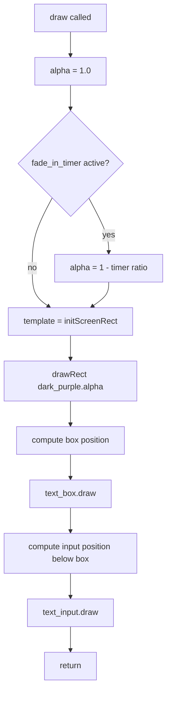
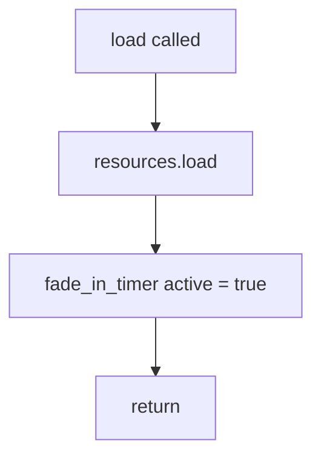
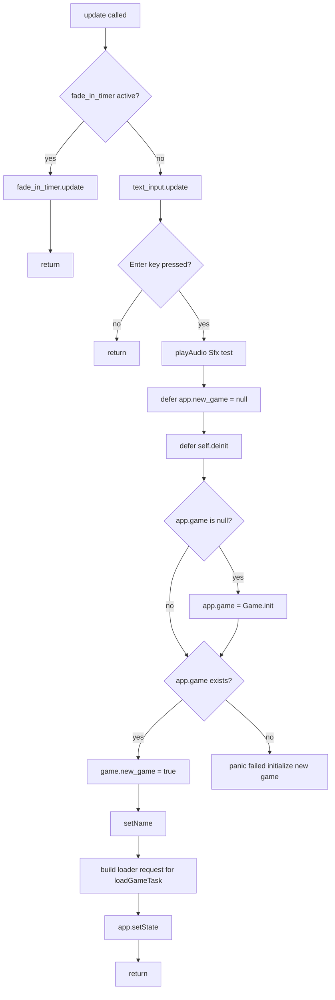

# src/modules/new_game/root.zig flow

## draw(self: \*NewGame, allocator, font)

```mermaid
flowchart TD
    A[draw called] --> B[alpha = 1.0]
    B --> C{fade_in_timer active?}
    C -- yes --> D[alpha = 1 - timer ratio]
    C -- no --> E
    D --> E[template = initScreenRect]
    E --> F[drawRect dark_purple.alpha]
    F --> G[compute box position]
    G --> H[text_box.draw]
    H --> I[compute input position below box]
    I --> J[text_input.draw]
    J --> Z[return]
```

## load(self: \*NewGame, io, ah)

```mermaid
flowchart TD
    A[load called] --> B[resources.load]
    B --> C[fade_in_timer active = true]
    C --> Z[return]
```

## update(self: \*NewGame, app)

```mermaid
flowchart TD
    A[update called] --> B{fade_in_timer active?}
    B -- yes --> C[fade_in_timer.update] --> Z1[return]
    B -- no --> D[text_input.update]
    D --> E{Enter key pressed?}
    E -- no --> Z2[return]
    E -- yes --> F[playAudio Sfx test]
    F --> G[defer app.new_game = null]
    G --> H[defer self.deinit]
    H --> I{app.game is null?}
    I -- yes --> J[app.game = Game.init]
    I -- no --> K
    J --> K{app.game exists?}
    K -- yes --> L[game.new_game = true]
    L --> M[setName]
    M --> N[build loader request for loadGameTask]
    N --> O[app.setState] --> Z3[return]
    K -- no --> P[panic failed initialize new game]
```
