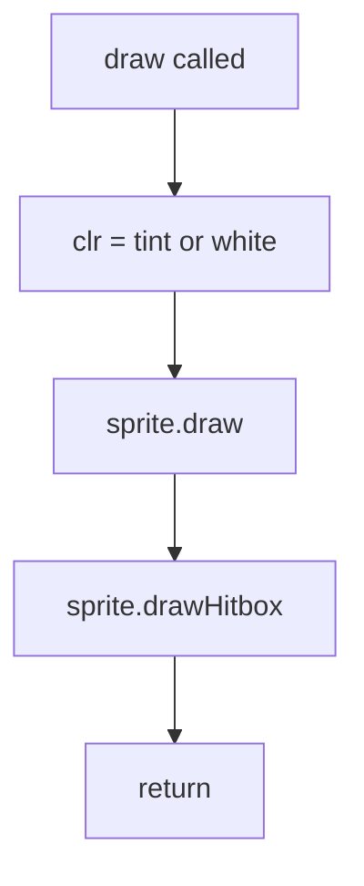
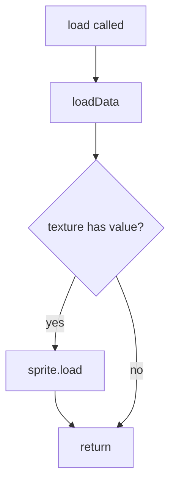
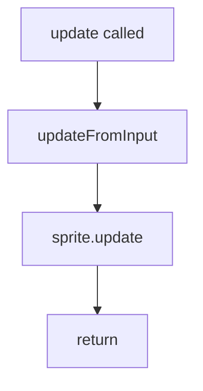
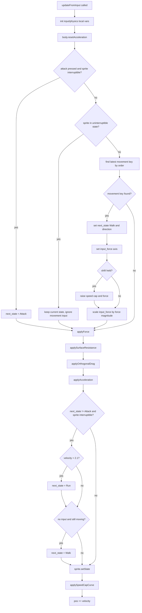

# src/modules/player/root.zig flow

## draw(self: \*Player, tint)

```mermaid
flowchart TD
    A[draw called] --> B[clr = tint or white]
    B --> C[sprite.draw]
    C --> D[sprite.drawHitbox]
    D --> Z[return]
```

## load(self: \*Player, texture, io)

```mermaid
flowchart TD
    A[load called] --> B[loadData]
    B --> C{texture has value?}
    C -- yes --> D[sprite.load] --> Z[return]
    C -- no --> Z
```

## update(self: \*Player, ih)

```mermaid
flowchart TD
    A[update called] --> B[updateFromInput]
    B --> C[sprite.update]
    C --> Z[return]
```

## updateFromInput(self: \*Player, ih)

```mermaid
flowchart TD
    A[updateFromInput called] --> B[init input/physics local vars]
    B --> C[body.resetAcceleration]
    C --> D{attack pressed and sprite interruptible?}
    D -- yes --> E[next_state = Attack]
    D -- no --> F{sprite in uninterruptible state?}
    F -- yes --> G[keep current state, ignore movement input]
    F -- no --> H[find latest movement key by order]
    H --> I{movement key found?}
    I -- yes --> J[set next_state Walk and direction]
    J --> K[set input_force axis]
    K --> L{shift held?}
    L -- yes --> M[raise speed cap and force]
    L -- no --> N
    M --> N[scale input_force by force magnitude]
    I -- no --> O

    E --> O[applyForce]
    G --> O
    N --> O

    O --> P[applySurfaceResistance]
    P --> Q[applyOrthogonalDrag]
    Q --> R[applyAcceleration]
    R --> S{next_state != Attack and sprite interruptible?}
    S -- yes --> T{velocity > 2.1?}
    T -- yes --> U[next_state = Run]
    T -- no --> V
    U --> V{no input and still moving?}
    V -- yes --> W[next_state = Walk]
    V -- no --> X
    S -- no --> X
    W --> X[sprite.setState]
    X --> Y[applySpeedCapCurve]
    Y --> Z[pos += velocity]
```
