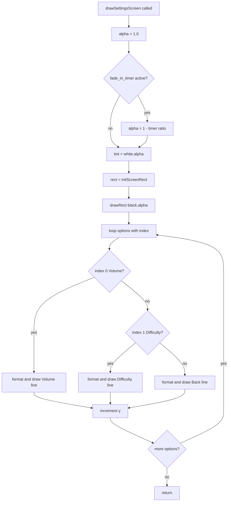
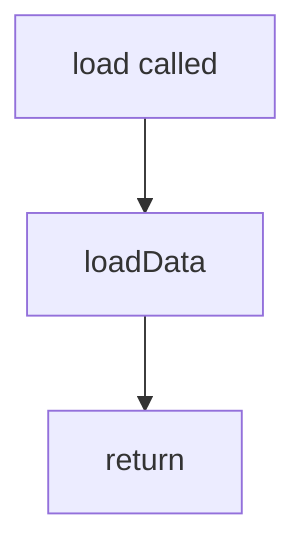
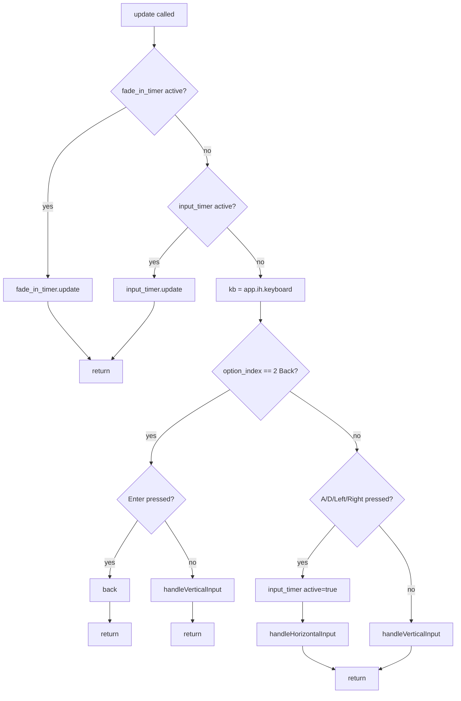

# src/modules/settings/root.zig flow

## drawSettingsScreen(self: \*Settings, font)

```mermaid
flowchart TD
    A[drawSettingsScreen called] --> B[alpha = 1.0]
    B --> C{fade_in_timer active?}
    C -- yes --> D[alpha = 1 - timer ratio]
    C -- no --> E
    D --> E[tint = white.alpha]
    E --> F[rect = initScreenRect]
    F --> G[drawRect black.alpha]
    G --> H[loop options with index]
    H --> I{index 0 Volume?}
    I -- yes --> J[format and draw Volume line]
    I -- no --> K{index 1 Difficulty?}
    K -- yes --> L[format and draw Difficulty line]
    K -- no --> M[format and draw Back line]
    J --> N[increment y]
    L --> N
    M --> N
    N --> O{more options?}
    O -- yes --> H
    O -- no --> Z[return]
```

## load(self: \*Settings, io)

```mermaid
flowchart TD
    A[load called] --> B[loadData]
    B --> Z[return]
```

## update(self: \*Settings, app)

```mermaid
flowchart TD
    A[update called] --> B{fade_in_timer active?}
    B -- yes --> C[fade_in_timer.update] --> Z1[return]
    B -- no --> D{input_timer active?}
    D -- yes --> E[input_timer.update] --> Z1
    D -- no --> F[kb = app.ih.keyboard]
    F --> G{option_index == 2 Back?}
    G -- yes --> H{Enter pressed?}
    H -- yes --> I[back] --> Z2[return]
    H -- no --> J[handleVerticalInput] --> Z3[return]

    G -- no --> K{A/D/Left/Right pressed?}
    K -- yes --> L[input_timer active=true]
    L --> M[handleHorizontalInput] --> Z4[return]
    K -- no --> N[handleVerticalInput] --> Z4
```
