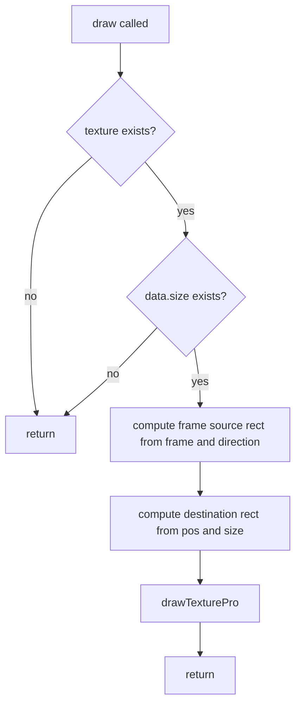
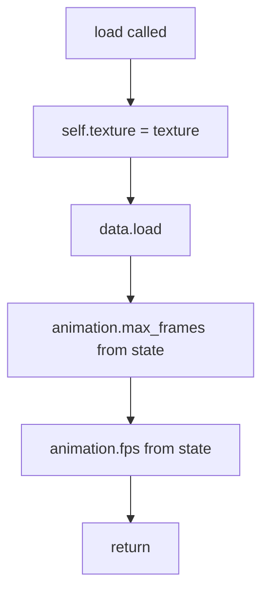
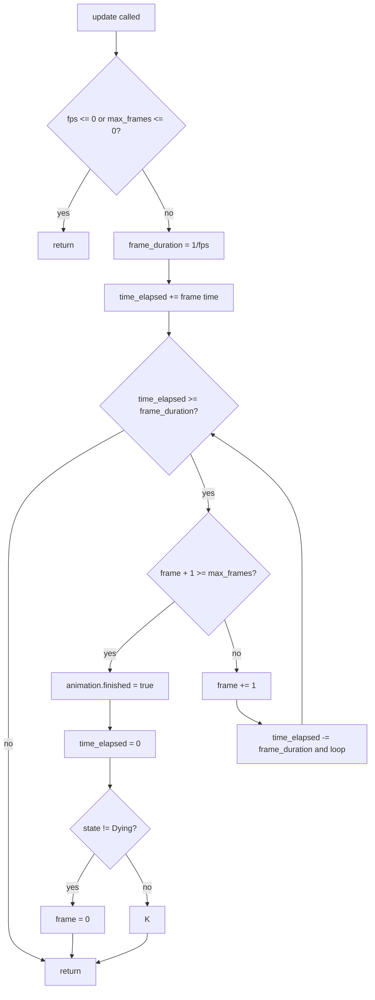

# src/modules/sprite/root.zig flow

## draw(self: \*Sprite, pos, tint)

```mermaid
flowchart TD
    A[draw called] --> B{texture exists?}
    B -- no --> Z1[return]
    B -- yes --> C{data.size exists?}
    C -- no --> Z1
    C -- yes --> D[compute frame source rect from frame and direction]
    D --> E[compute destination rect from pos and size]
    E --> F[drawTexturePro]
    F --> Z2[return]
```

## load(self: \*Sprite, texture, io)

```mermaid
flowchart TD
    A[load called] --> B[self.texture = texture]
    B --> C[data.load]
    C --> D[animation.max_frames from state]
    D --> E[animation.fps from state]
    E --> Z[return]
```

## update(self: \*Sprite)

```mermaid
flowchart TD
    A[update called] --> B{fps <= 0 or max_frames <= 0?}
    B -- yes --> Z1[return]
    B -- no --> C[frame_duration = 1/fps]
    C --> D[time_elapsed += frame time]
    D --> E{time_elapsed >= frame_duration?}
    E -- no --> Z2[return]
    E -- yes --> F{frame + 1 >= max_frames?}
    F -- yes --> G[animation.finished = true]
    G --> H[time_elapsed = 0]
    H --> I{state != Dying?}
    I -- yes --> J[frame = 0]
    I -- no --> K
    J --> Z2
    K --> Z2
    F -- no --> L[frame += 1]
    L --> M[time_elapsed -= frame_duration and loop]
    M --> E
```
