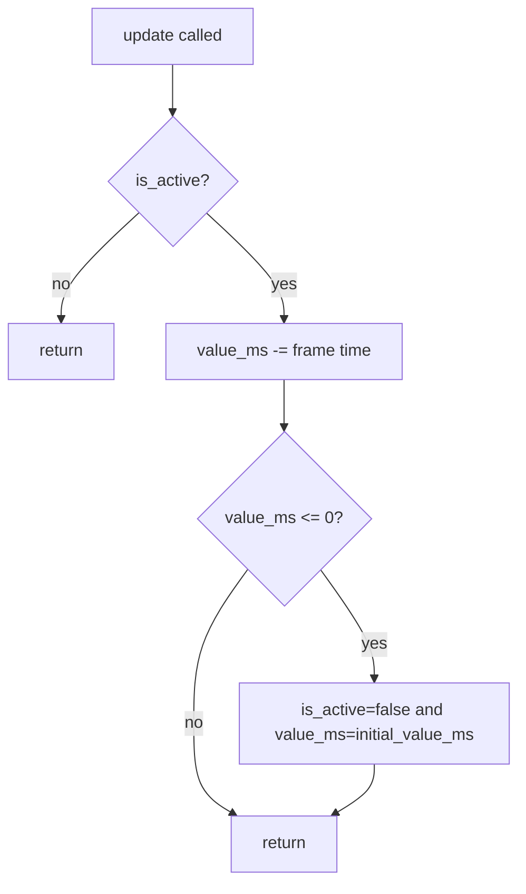

# src/modules/timer/root.zig flow

## update(self: \*Timer)

```mermaid
flowchart TD
    A[update called] --> B{is_active?}
    B -- no --> Z1[return]
    B -- yes --> C[value_ms -= frame time]
    C --> D{value_ms <= 0?}
    D -- yes --> E[is_active=false and value_ms=initial_value_ms]
    D -- no --> Z2[return]
    E --> Z2
```

## draw

No draw method exists in this root file.

## load

No load method exists in this root file.
