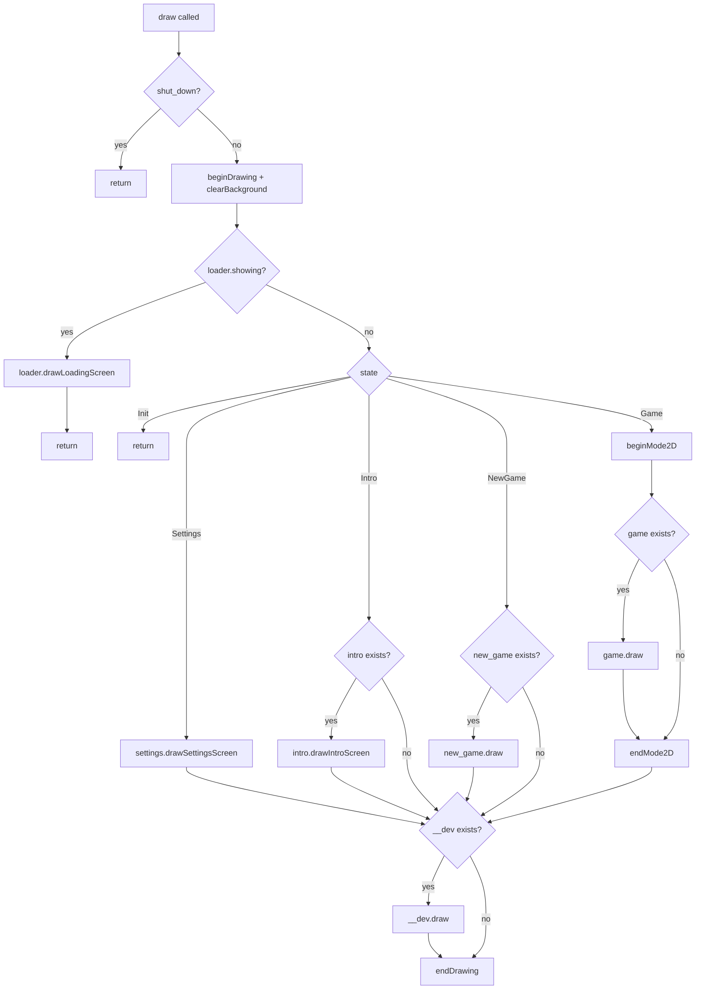
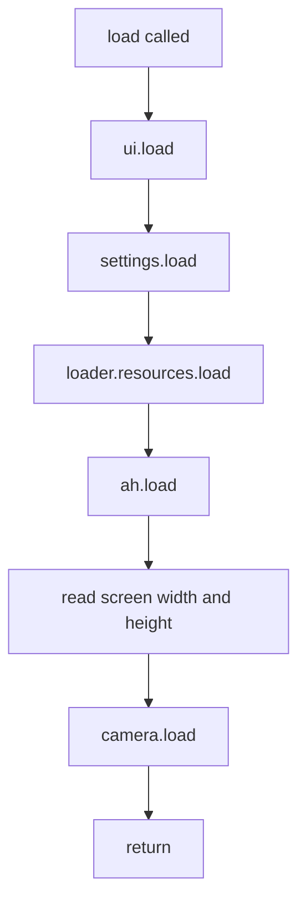
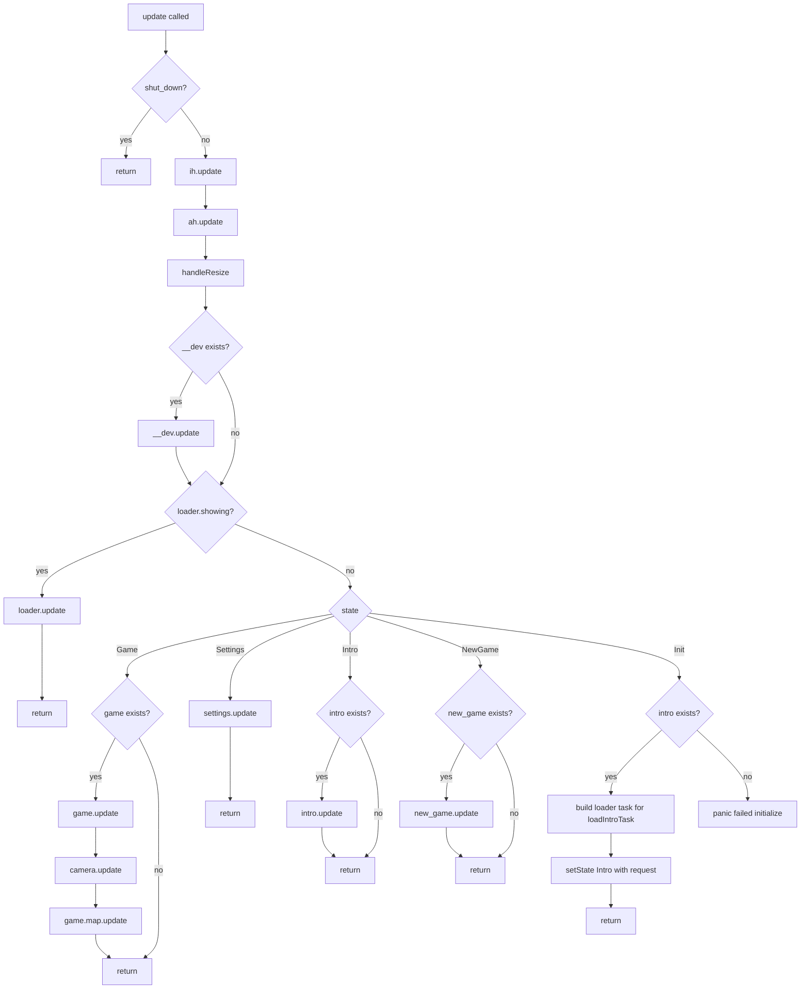

# src/root.zig flow

## draw(self: \*App)

```mermaid
flowchart TD
    A[draw called] --> B{shut_down?}
    B -- yes --> Z1[return]
    B -- no --> C[beginDrawing + clearBackground]
    C --> D{loader.showing?}
    D -- yes --> E[loader.drawLoadingScreen] --> Z2[return]
    D -- no --> F{state}
    F -- Init --> Z3[return]
    F -- Settings --> G[settings.drawSettingsScreen]
    F -- Intro --> H{intro exists?}
    H -- yes --> H1[intro.drawIntroScreen]
    H -- no --> J
    F -- NewGame --> I{new_game exists?}
    I -- yes --> I1[new_game.draw]
    I -- no --> J
    F -- Game --> K[beginMode2D] --> K1{game exists?}
    K1 -- yes --> K2[game.draw]
    K1 -- no --> K3[endMode2D]
    K2 --> K3[endMode2D]
    G --> J{__dev exists?}
    H1 --> J
    I1 --> J
    K3 --> J
    J -- yes --> L[__dev.draw] --> Z4[endDrawing]
    J -- no --> Z4[endDrawing]
```

## load(self: \*App)

```mermaid
flowchart TD
    A[load called] --> B[ui.load]
    B --> C[settings.load]
    C --> D[loader.resources.load]
    D --> E[ah.load]
    E --> F[read screen width and height]
    F --> G[camera.load]
    G --> Z[return]
```

## update(self: \*App)

```mermaid
flowchart TD
    A[update called] --> B{shut_down?}
    B -- yes --> Z1[return]
    B -- no --> C[ih.update]
    C --> D[ah.update]
    D --> E[handleResize]
    E --> F{__dev exists?}
    F -- yes --> G[__dev.update]
    F -- no --> H
    G --> H{loader.showing?}
    H -- yes --> I[loader.update] --> Z2[return]
    H -- no --> J{state}

    J -- Game --> K{game exists?}
    K -- yes --> K1[game.update] --> K2[camera.update] --> K3[game.map.update] --> Z3[return]
    K -- no --> Z3

    J -- Settings --> L[settings.update] --> Z4[return]

    J -- Intro --> M{intro exists?}
    M -- yes --> M1[intro.update] --> Z5[return]
    M -- no --> Z5

    J -- NewGame --> N{new_game exists?}
    N -- yes --> N1[new_game.update] --> Z6[return]
    N -- no --> Z6

    J -- Init --> O{intro exists?}
    O -- yes --> O1[build loader task for loadIntroTask] --> O2[setState Intro with request] --> Z7[return]
    O -- no --> O3[panic failed initialize]
```
