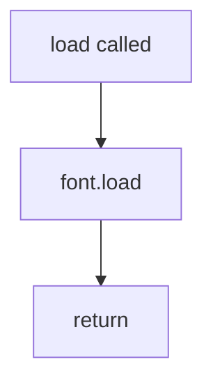

# src/\_ui/root.zig flow

## load(self: \*Ui)

```mermaid
flowchart TD
    A[load called] --> B[font.load]
    B --> Z[return]
```

## draw

No draw method exists in this root file.

## update

No update method exists in this root file.
